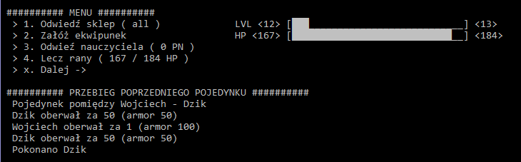
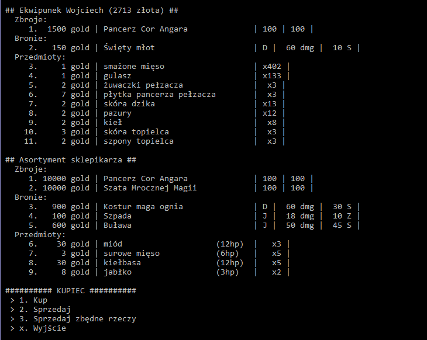

# RPG_Game

I made this game for educational purposes. In this project, I tested various elements and syntax of the C# language. 
I used object-oriented programming according to SOLID principles. I used serialization, file operations, interfaces, inheritance, collections and many other things. 

Items, monster names, stats are taken from the existing game Gothic 2 The Night of the Raven. 

The game contains mechanics that allow me to create various types of games. 
Maybe in my spare time I use this logic to create another one. 

Currently, I have implemented objects, NPCs and general gameplay. 
Using this logic and creating views and controllers I have created a prototype as a console application. 

The game is engaging. It requires proper management of your inventory and resources 

## Running the application

The main purpose of developing this application was to present the C# code, but of course game is playable.

To do it, just download the alpha release, unpack and dubble-click RPG_Game.exe file.

You can also download source code, compile and play that way.

## Game mechanics

When you start the game for the first time, you create your character giving him a name. 
The rest of the statistics are set automatically. When you start the game again, you use the option to load saved characters.

The fight takes place automatically. Character and monster statistics, armor, weapons, and combat skills with a given weapon are taken into account during the skirmish.

The fights are fought against creatures from the world of Gothic. The hero can obtain trophies, resources and food from them.

After the fight, we get experience, thanks to which the character can advance to the next level. 
He then receives Experience Points, which we spend on developing the skills of Strength, Dexterity, Fighting with one-handed, two-handed weapons, archery or crossbowing.

We sell the trophies at merchants. The type of store is random, so we can meet the Armory, Weaponry, Trader or vendor with a bit of everything. 
You can also use the option of selling all useless items quickly, so you don't spend a lot of time clicking through small things.

If we have properly raised character statistics, we can equip the purchased equipment on the hero.

During combat, the character takes damage that must be healed later with food or potions. 
Proper management of resources, gold owned, is required to always have something that can be used for healing.  

After each victorious fight, the character's state is saved. 

## Screenshots

The first thing you'll see when you start the game is the main menu screen.

In this window you can start New Game or continue your prevous story using Load Game

Then you will see this menu. You spend the most time in this window. On the left side there are places and available actions to be performed. 
There are 2 bars on the right side, one shows how much experience your character needs to increase his level. 
The second bar shows your character's health points. At the bottom of the view, he shows us the log of the previous battle. 
You can read who your opponent was and the damage you dealt

Po wybraniu jednej z akcji wyświetli się jeden z poniższych widoków: 

There is a merchant here where you can buy and sell goods. The second is a teacher who will improve your character skills. 
The last screen shot shows the treatment. You can choose the item you want to heal your character. 

After you have done all the steps you want, you can go to the next step by pressing `x`. 
Your character will fight a random enemy (determined by your level) and then another random merchant and teacher will be generated.

## Controls

To select an action, just enter its number `1`, `2`, `3`, etc. 
The numbers can also be used when interacting with traders, teachers, and while healing or equipping characters. 
In some windows you can also enter the full name of the item, but this method takes more time than just entering the item number.
To cancel the action, press `Esc` 

